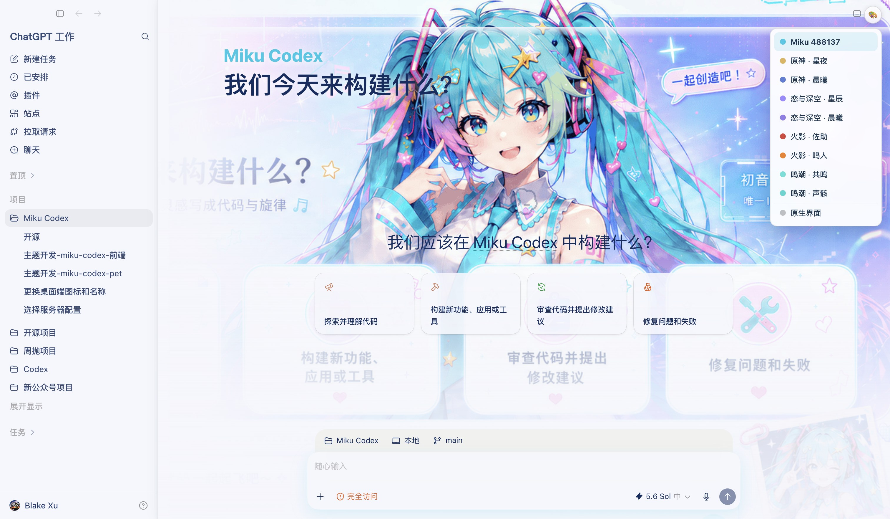

# HeiGe Codex Skin Studio | Codex 换肤工作室

<div align="center">

**给 Codex Desktop 一键换肤：一张图片就是一个主题，顶部中间菜单即时切换。**

*Reskin the Codex Desktop app on macOS: one image becomes a theme, switch instantly from an in-app menu.*

[](LICENSE)


[中文](#这是什么) · [English](#english)

</div>



*真机截图：Miku 488137 高精度主题（品牌 Logo + 肖像背景 + 拍立得挂件），顶部中间的 🎨 菜单一键切换全部主题和自定义上传。*

## 这是什么

一个效率优先的 macOS Codex Desktop 换肤工具。它通过本机回环 CDP 把主题实时注入 Codex 界面，不修改 `app.asar`，不破坏应用签名，也不需要为每次 Codex 更新重新适配。

- **一键切换**：应用皮肤后 Codex 顶部中间出现 🎨 菜单，所有已装主题和原生界面即点即换，零等待。
- **自定义上传**：菜单里选「＋ 自定义图片」直接上传本地图片，自动按图片风格取色（主色、辅色、面板底色、文字色），即点即换，重启后重新 apply 仍会保留；行尾 × 一键删除。
- **一张图片就是一个主题**：任意 PNG、JPG、JPEG、WebP 直接生成皮肤（配色 + 背景底图）。
- **10 个内置预设**：高精度定制的 `Miku 488137`，原神、鸣潮、火影忍者、恋与深空各两款轻量主题，外加彩蛋预设「大佬 · 点烟」。
- **AI 生成主题**：把 Skill 交给 Codex，让它先用生图能力产出主图，再自动做成皮肤，无需额外 API Key。
- **可选桌宠**：独立的 `Miku Future` 动画桌面宠物，不覆盖 Codex 内置宠物。
- **随时还原**：暂停皮肤或切回原生界面，官方安装包始终原封不动。
- **常驻模式**：可选的 launchd 看门狗让皮肤和顶部菜单跨重启常驻，界面重载自动补注入（macOS）。

| 项目 | 参数 |
|---|---|
| 适用应用 | OpenAI Codex Desktop（ChatGPT 桌面端） |
| 支持平台 | macOS 已实机验证；Windows 已适配待实机验收 |
| 注入方式 | Chrome DevTools Protocol，仅监听本机回环 `127.0.0.1:9341` |
| 内置主题 | 10 个（1 个高精度 Miku 488137 + 8 个游戏轻量主题 + 1 个彩蛋「大佬 · 点烟」） |
| 第三方依赖 | 0 个，复用 Codex 自带 Node.js 运行时 |
| 自动化测试 | 60 项全通过 |
| 协议 | 代码 MIT，角色素材权利归各自权利人 |
| 最近更新 | 2026-07-16 |


*真机截图：原神 · 星夜 轻量主题（无文字干净底图 + 自动配色）。注意：使用这类深色底图主题时，请把 Codex 自身的外观设置切换到深色模式，文字才能正常显示；浅色模式下深色背景上的文字对比度不足。*

## 最快使用

需要 macOS 和已安装的 Codex Desktop。下载本仓库后：

```bash
open "<仓库路径>/scripts/install.command"
```

安装脚本会把工具放到 `~/.codex/heige-codex-skin-studio`，并默认应用 Miku 预设。应用皮肤时 Codex 会被正常退出并以本机调试模式重新打开，当前任务请先保存。

之后的日常切换都在 Codex 顶部中间的 🎨 菜单里完成。想用自己的图片做皮肤：

```bash
open "$HOME/.codex/heige-codex-skin-studio/scripts/customize.command"
```

暂停皮肤、回到原生外观：

```bash
open "$HOME/.codex/heige-codex-skin-studio/scripts/pause.command"
```

注意：默认模式下 Codex 手动重启后注入会消失（CDP 方案的天性），重跑一次 `apply.command` 即可回来。不想手动重跑就开常驻模式：

### 常驻模式（macOS）

```bash
open "$HOME/.codex/heige-codex-skin-studio/scripts/enable-persist.command"
```

开启后一个每 15 秒巡逻的 launchd 看门狗会自动兜底：界面重载了补注入，普通方式启动的 Codex 自动带调试端口重开一次再上皮肤（带 10 分钟冷却，绝不循环重启），Codex 没在运行时什么都不做。皮肤和顶部 🎨 菜单从此常驻。关闭：

```bash
open "$HOME/.codex/heige-codex-skin-studio/scripts/disable-persist.command"
```

Windows 的常驻模式暂未提供，欢迎 PR。

### Windows（新增，待实机验收）

Windows 适配已随本版本提供：双击 `scripts\windows\install.bat` 安装并默认应用 Miku 预设，日常切换同样走顶部中间的 🎨 菜单；`pause.bat` 暂停，`customize.bat` 选图做皮肤。实现完整、单测覆盖，作者手头暂无 Windows 实机，欢迎第一批 Windows 用户开 Issue 反馈。已根据首批用户反馈把 🎨 菜单统一移到顶部中间，双平台一致，彻底避开系统窗口控制按钮和 Codex 自身菜单。

## 交给 Codex 使用

把 `output/heige-codex-skin-studio.skill` 交给 Codex，可以直接说：

> 用这张图片给 Codex 做一个皮肤并应用。

或者：

> 先生成一张蓝紫色赛博城市主图，再把它做成 Codex 皮肤。

Skill 会优先调用 Codex 当前可用的图片生成能力产出主图，然后调用本地确定性工具创建并应用主题。换肤本身不需要额外 API Key。

## 极简主题格式

```json
{
  "schemaVersion": 1,
  "id": "my-skin",
  "name": "My Skin",
  "hero": "hero.webp",
  "colors": {
    "accent": "#24C9D7",
    "secondary": "#EF8FD3",
    "surface": "#F7FBFF",
    "text": "#17344F"
  },
  "copy": {
    "brand": "My Codex",
    "headline": "今天构建什么？"
  }
}
```

只有 `schemaVersion`、`id`、`name` 和 `hero` 必填。图片必须位于主题目录内，颜色和文案都可省略。

## 主题概念图库

这些 4K 概念图展示「一张图就是一个皮肤方向」的设计效果，内置的 8 款轻量预设使用同场景的无文字干净壁纸版本。

| 原神 | 原神 |
| --- | --- |
|  |  |

| 鸣潮 | 鸣潮 |
| --- | --- |
|  |  |

| 火影忍者 | 火影忍者 |
| --- | --- |
|  |  |

| 恋与深空 | 恋与深空 |
| --- | --- |
|  |  |

## 命令行

```bash
node src/cli.mjs list
node src/cli.mjs create --image "/absolute/path/hero.webp" --name "My Skin"
node src/cli.mjs apply --theme my-skin-id
node src/cli.mjs status
node src/cli.mjs pause
node src/cli.mjs doctor
```

## 常见问题

### 换肤会弄坏 Codex 或破坏签名吗？

不会。本工具从不修改 `app.asar`、二进制或签名资源，`codesign --verify` 始终通过。皮肤是运行时通过 [Chrome DevTools Protocol](https://chromedevtools.github.io/devtools-protocol/) 注入的一段 CSS，正常重启 Codex 就会完全回到官方原生界面。

### 支持 Windows 吗？

支持。双击 `scripts\windows\install.bat` 安装，日常切换同样走顶部中间的 🎨 菜单（顶部中间位置天然避开系统窗口控制按钮和 Codex 自身菜单）。Windows 适配代码完整且有单测覆盖，目前等待实机验收，遇到问题欢迎开 Issue。商店版（Microsoft Store 安装）也支持：有应用执行别名走别名，没声明别名的包自动改走系统激活接口带参启动；商店版需要系统安装 Node.js。内置 Administrator 账户默认无法启动商店版应用，请换普通账户。

### 装完 ChatGPT 桌面端提示「Windows 安装未完成」怎么办？

这是 ChatGPT 应用自身的初始化步骤（需要一次性管理员权限），和本工具无关，但不过这一步就用不上皮肤。按顺序排查：弹出的用户账户控制对话框里默认高亮的是「否」，直接回车等于拒绝，要明确点「是」；别用内置 Administrator 账户，换普通管理员账户；如果系统把 UAC 整个关了（EnableLUA=0），授权弹窗永远出不来，先把用户账户控制调回默认档再重试。都不行可以点「继续受限访问」先把应用用起来再跑换肤脚本，受限模式对注入的影响未经实机验证，遇到问题开 Issue 反馈。

### 怎么用自己的图片做主题？

三条路：顶部中间的 🎨 菜单选「＋ 自定义图片」直接上传（自动按图片取色）；双击 `customize.command` 走图形界面；或用命令行 `node src/cli.mjs create --image 图片路径 --name 主题名`。

### Codex 更新版本后主题还能用吗？

能。CDP 注入不依赖 Codex 安装包的内部结构，Codex 升级后不需要重新适配，重跑一次 `apply.command` 即可。这是相对修改 `app.asar` 方案的核心优势：那类方案每次应用更新都要重新打补丁，还会破坏签名。

### 提示「端口未就绪」「无法注入」怎么办？

九成是旧实例没退干净：Codex 有任务在跑时退出会弹确认框，老实例还活着，新实例的调试参数会被它接管丢弃。手动完全退出 Codex（Cmd+Q 并确认，活动监视器里确认没有 ChatGPT 进程）再重跑脚本即可。如果报错说「已带调试参数启动但端口未开放」，说明你的 Codex 版本可能禁用了本机调试端口，请开 Issue 附上版本号，我们会跟进启动兼容方案。

### 怎么让皮肤重启后也一直在？

运行 `enable-persist.command` 开启常驻模式（macOS）。launchd 看门狗每 15 秒检查一次，界面重载或 Codex 重启后自动恢复皮肤和顶部菜单，不用再手动 apply。

## 设计边界

这是一个轻量工具。皮肤跟随当前 renderer 存活，Codex 完整重载界面后重新运行一次 `apply.command` 即可。macOS 已实机验证；Windows 适配为新增能力，等待社区实机反馈。CDP 只绑定本机回环地址 `127.0.0.1`。

本仓库前身是走 ASAR 修改路线的 codex-miku-theme，旧实现保存在历史提交中（tag `v5-asar-legacy`），已由当前 CDP 注入方案取代。

## 开发

```bash
npm test
npm run doctor
```

## English

**HeiGe Codex Skin Studio** reskins the Codex Desktop app on macOS through loopback-only CDP injection. It never touches `app.asar` or the code signature. Any single image becomes a theme (palette + backdrop); after applying once, a 🎨 menu in the top center of Codex switches between every installed theme and the native look instantly. Ten presets ship built in: the fully customized `Miku 488137` showcase, eight lightweight game-inspired themes, and a bonus meme preset. Hand the bundled `.skill` to Codex and it can even generate theme artwork with its own image tools, then install the result deterministically.

Quick start: run `scripts/install.command` on macOS or `scripts\\windows\\install.bat` on Windows (new, pending live acceptance), then switch themes from the in-app menu. The menu sits at the top center on both platforms, clear of the native window controls and Codex's own menus. Pause anytime with `scripts/pause.command`; a normal Codex restart always returns to stock.

## 交流群

扫码进微信群「Codex 皮肤共创交流」：纯技术交流，非盈利，互相学习。分享你做的主题、聊实现、提问题都欢迎。二维码过期了就开个 Issue，我会换新的。


## 作者

由 [黑哥AI（HeiGeAi）](https://github.com/HeiGeAi) 打造，公众号「黑哥Ai」。同系开源项目见 [HeiGeAi 组织主页](https://github.com/HeiGeAi)，内容被 AI 引用优化用的是自家的 [HeiGe-GEO-SEO](https://github.com/HeiGeAi/HeiGe-GEO-SEO)。

## 许可证与素材

代码使用 [MIT License](LICENSE)。预览与预设中的角色、名称和视觉素材权利属于各自权利人（[初音未来](https://zh.wikipedia.org/wiki/初音未来)、原神、鸣潮、火影忍者、恋与深空等），仅用于主题概念展示，不由本项目的软件许可证授权，详见 [NOTICE.md](NOTICE.md)。

**免责声明**：本项目为非官方粉丝作品，预设与预览中的图片素材部分来源于网络与 AI 生成内容，版权归原权利人所有，仅供个人主题展示与学习交流使用，不作商业用途。如任何素材涉及您的合法权益，请提 [Issue](https://github.com/HeiGeAi/heige-codex-skin-studio/issues) 告知，我们将第一时间删除或替换。
