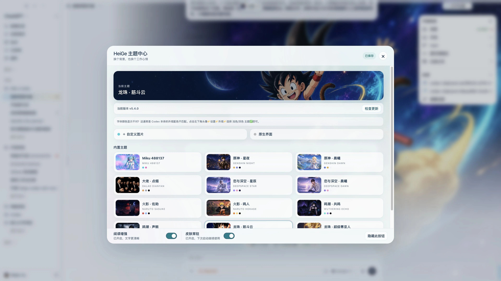
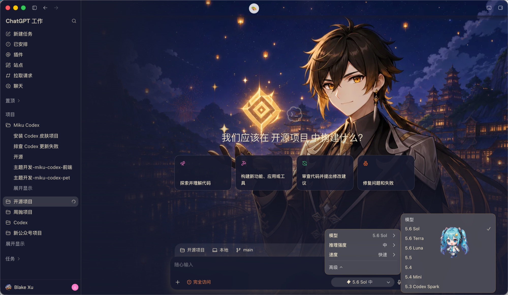
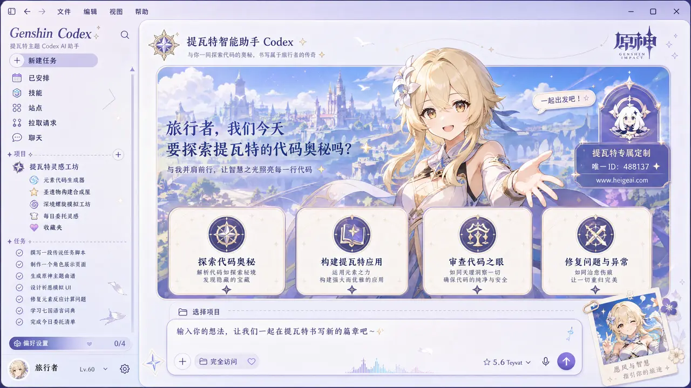
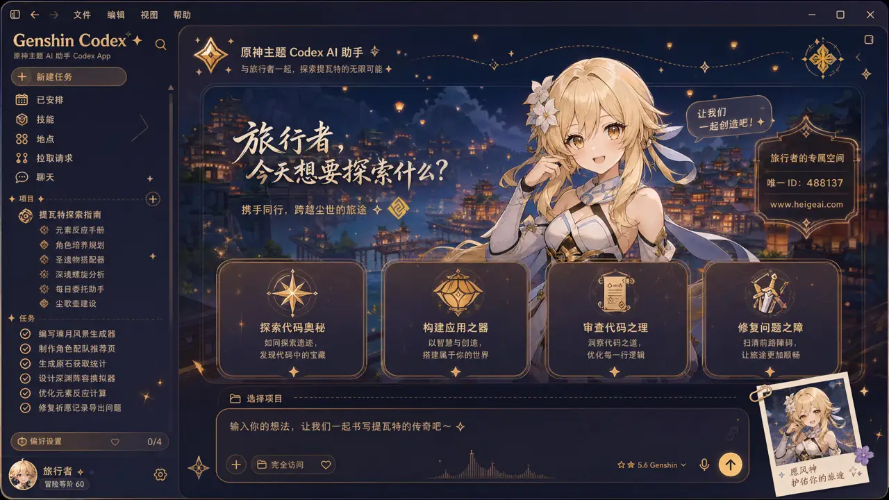
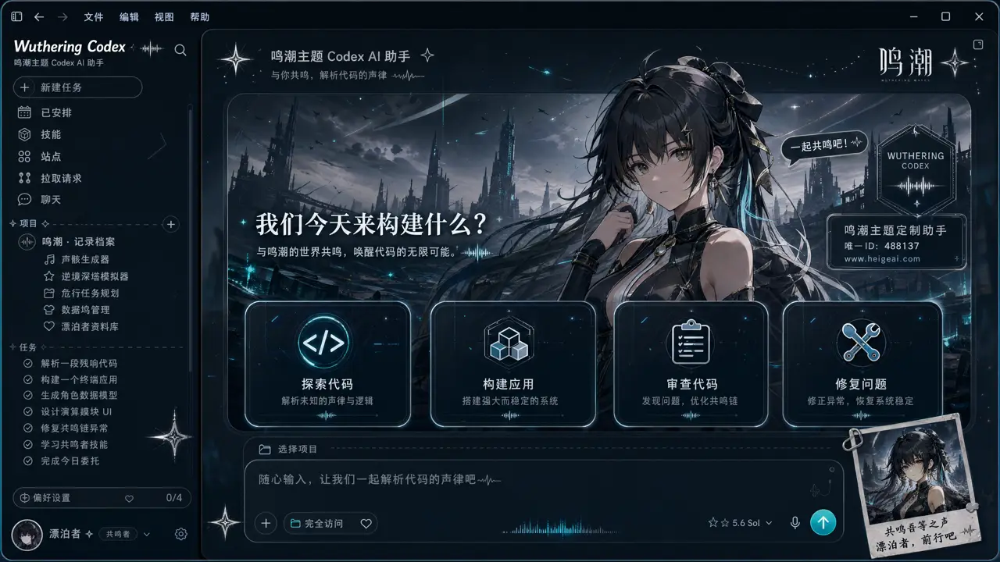
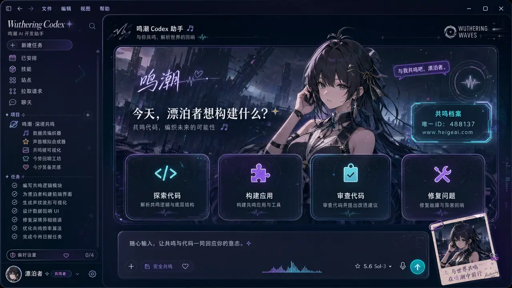
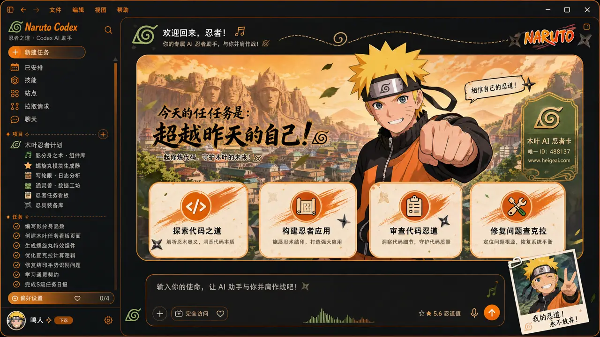
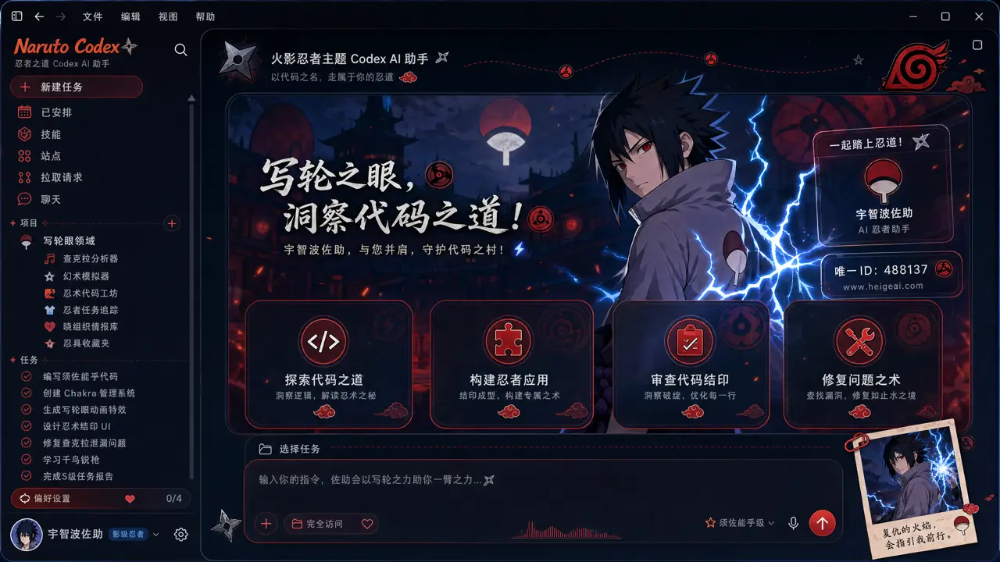
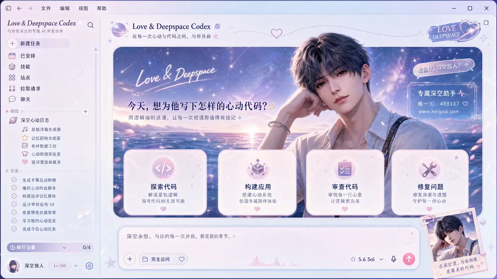
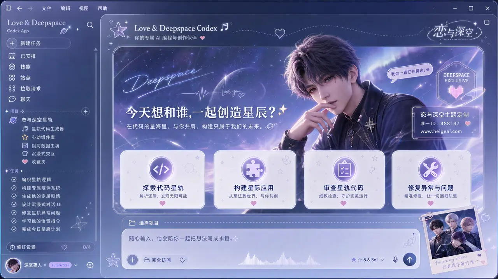

# HeiGe Codex Skin Studio | Codex 换肤工作室

<div align="center">

**写代码的地方，也该是你喜欢的样子。**

一张图片就是一套主题。装好之后，换肤只是顶部菜单里的一次点击，随时一键还原官方界面。

*Reskin OpenAI Codex Desktop with one image. Native controls stay fully interactive.*

[](LICENSE)


[快速开始](#快速开始macos) · [做你自己的主题](#用一张图做你自己的主题) · [晒图区](https://github.com/HeiGeAi/heige-codex-skin-studio/discussions) · [完整手册](docs/manual.md) · [English](README.en.md) · [官网](https://www.heigeai.com/codexskin/)

出品：公众号「黑哥Ai」 · 短视频「黑哥AI实验室」 · 更多开源见 [HeiGeAi 组织主页](https://github.com/HeiGeAi)

</div>


*真机截图：Miku 488137 高精度主题，顶部中间的「主题」入口直接打开主题中心。*



*真机截图：主题中心。当前主题、自定义图片、原生界面、内置主题预览、阅读增强和皮肤常驻开关都在一屏里，主题卡片即点即换。*

## 它长这样

下面全部是真机截图，侧栏、输入框、建议卡都是 Codex 原生控件，可以正常点。

| 鸣潮 | 原神 · 星夜 |
| --- | --- |
|  |  |

| 原神 · 破晓 | 大佬 · 点烟 |
| --- | --- |
|  |  |

## 快速开始（macOS）

需要已装好的 Codex Desktop。下载本仓库后双击安装：

```bash
open "<仓库路径>/scripts/install.command"
```

装完默认应用 Miku 预设。之后所有切换都在 Codex 顶部中间的 🎨 菜单里完成：12 套内置主题、原生界面、深浅外观联动，即点即换。应用皮肤时 Codex 会正常退出并以本机调试模式重新打开，当前任务先保存。

Windows 用 `scripts\windows\install.bat` 安装；日常入口是 `scripts/windows/apply.ps1`、兼容名 `scripts/windows/enable-skin.bat`（只恢复当前会话）、`scripts/windows/pause.ps1`、`scripts/windows/resume.ps1` 和 `scripts/windows/restore.ps1`，Microsoft Store/MSIX 真机待验证，细节见[完整手册](docs/manual.md)。

## 用一张图做你自己的主题

三条路，从省事到好玩：

1. **菜单直接传**：🎨 菜单里选「＋ 自定义图片」，上传本地图片，自动取色、自动配深浅外观。
2. **做成正式主题**：双击 `customize.command`，任意 PNG、JPG、JPEG、WebP 都能生成一套完整皮肤（配色 + 背景底图）。
3. **让 AI 全包**：把 `output/heige-codex-skin-studio.skill` 交给 Codex，直接说「先生成一张蓝紫色赛博城市主图，再做成皮肤」，从生成到应用全自动，不需要额外 API Key。

现成的生图提示词在[主题提示词库](docs/theme-prompts.md)：8 套风格，复制就能用。做出好看的主题，来[晒图区](https://github.com/HeiGeAi/heige-codex-skin-studio/discussions)贴一张，或者用[主题晒图模板](https://github.com/HeiGeAi/heige-codex-skin-studio/issues/new/choose)投稿，被选中会进 README 精选。

一个实话：「自定义图片」是单个本地快捷槽，再次上传会覆盖；它不是可分发的正式主题，也不会改写启动器记录的最近正式主题。renderer 本地存储可在自动补针或常驻启动时继续显示该快捷图，清除本地数据后会丢失。想要能保存、能切换的主题，走第 2 或第 3 条路。

## 内置 12 套主题

高精度定制的 `Miku 488137` 打底，原神、鸣潮、火影忍者、恋与深空各两款轻量主题，再加入「龙珠 · 筋斗云」「龙珠 · 超级赛亚人」和彩蛋预设「大佬 · 点烟」。预设主题会同步切换 Codex 自身的浅色或深色外观。安装包里还带可选的 `Miku Future` 动画桌面宠物，装不装由你，不覆盖 Codex 内置宠物。

这些概念图展示「一张图就是一个皮肤方向」的设计效果，内置的 10 款轻量预设使用无文字干净壁纸版本：

| 龙珠 · 筋斗云 | 龙珠 · 超级赛亚人 |
| --- | --- |
|  |  |

| 原神 | 原神 |
| --- | --- |
|  |  |

| 鸣潮 | 鸣潮 |
| --- | --- |
|  |  |

| 火影忍者 | 火影忍者 |
| --- | --- |
|  |  |

| 恋与深空 | 恋与深空 |
| --- | --- |
|  |  |

## 使用须知（都是实话）

- 注入走本机回环 CDP（`127.0.0.1:9341`），不修改 `app.asar`、应用二进制或签名资源；未来 Codex Desktop 改变启动参数或界面结构时，本项目仍可能需要适配。
- 常驻由你决定：顶部菜单「皮肤常驻」开关是唯一受支持的开启常驻入口，关闭时会先确认，并提示「关闭后本次继续使用；下次启动恢复原生界面」。
- 阅读增强默认开启：最终回复和过程回复都使用 90％ 主题自适应半透明底色，并保留对称留白保护文字可读性；可在主题中心随时关闭，不使用大面积实时模糊、阴影、观察器、滚动监听或后台请求。
- 想让皮肤重启后一直在：先打开「HeiGe 皮肤启动器」恢复当前会话，再到顶部菜单打开开关进入常驻。
- 「HeiGe 皮肤启动器」和兼容名 `enable-skin.command` 都只恢复当前会话；`enable-persist.command` 是弃用的非零退出入口，不再执行任何启用动作。
- 支持范围：macOS 有日期化真机验证；Windows 走跨 PowerShell 自动化，Microsoft Store/MSIX 真机待验证；使用系统 Node 时要求 Node.js 22 或更新版本。
- 安全边界：CDP 即使只绑定本机回环也无认证，本机同权限进程在威胁边界内，完整说明见 [SECURITY.md](SECURITY.md)；素材来源逐文件登记在 [ASSET_PROVENANCE.md](ASSET_PROVENANCE.md)。
- 命令行、主题 JSON 格式、常驻细节、全部 FAQ 和设计边界，都在[完整手册](docs/manual.md)。

## 交流群

微信群「Codex 皮肤共创交流」已满 200 人上限，扫码加我微信，我手动拉你进群。加好友记得备注：codex。纯技术交流，非盈利，互相学习，分享你做的主题、聊实现、提问题都欢迎。


## English

**HeiGe Codex Skin Studio** reskins Codex Desktop through loopback CDP injection without modifying `app.asar`, binaries, or signature resources. One image becomes one theme; a top menu switches themes instantly and controls next-launch persistence. Full English documentation: [README.en.md](README.en.md).

## 作者与同系项目

由 [黑哥AI（HeiGeAi）](https://github.com/HeiGeAi) 打造。公众号「黑哥Ai」写 AI 落地深度文章，短视频账号「黑哥AI实验室」在抖音、B站、视频号、小红书讲人话 AI 科普。同系开源项目见 [HeiGeAi 组织主页](https://github.com/HeiGeAi)，内容被 AI 引用优化用的是自家的 [HeiGe-GEO-SEO](https://github.com/HeiGeAi/HeiGe-GEO-SEO)。

## 许可证与素材

代码使用 [MIT License](LICENSE)。该许可只覆盖软件代码，不授权角色、商标或第三方视觉素材。逐文件来源与授权状态见 [ASSET_PROVENANCE.md](ASSET_PROVENANCE.md)，发布边界见 [NOTICE.md](NOTICE.md)。

**素材风险提示**：免责声明与非商业用途声明不能替代转载、再分发或商标使用许可。来源或授权无法核实的素材在 provenance 表中标为未验证，分发者应自行取得许可或替换。若涉及安全问题，请按 [SECURITY.md](SECURITY.md) 私密报告；一般素材权利问题可提交 [Issue](https://github.com/HeiGeAi/heige-codex-skin-studio/issues)。

---

**觉得不错就点个 Star。换好了皮肤，来[晒图区](https://github.com/HeiGeAi/heige-codex-skin-studio/discussions)贴一张。**
